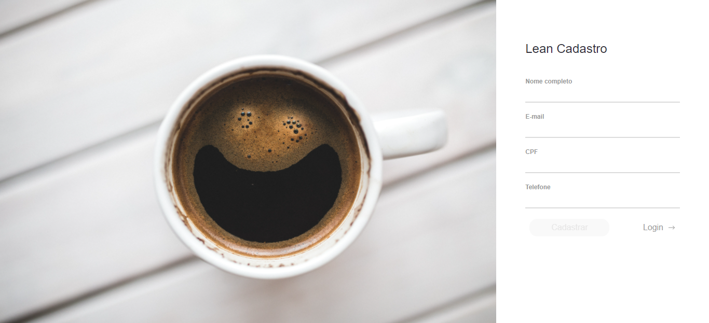
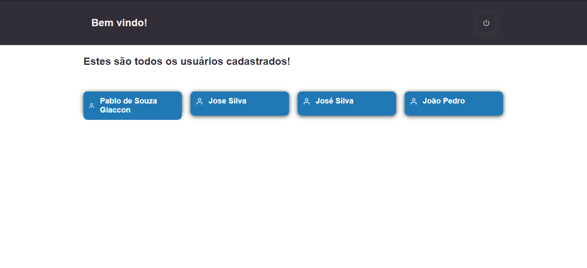

<h1 align="center">
  Lean Cadastro
</h1>

<br />

<p align="center">
  

  

  <a href="https://github.com/pablogiaccon/Learn-CRUD/commits/master">
    
  </a>

  <a href="https://github.com/pablogiaccon/Learn-CRUD/issues">
    
  </a>

  
</p>

<p align="center">
  <a href="#tecnologias">Tecnologias</a>&nbsp;&nbsp;&nbsp;|&nbsp;&nbsp;&nbsp;
  <a href="#projeto">Projeto</a>&nbsp;&nbsp;&nbsp;|&nbsp;&nbsp;&nbsp;
  <a href="#como-executar">Como executar</a>&nbsp;&nbsp;&nbsp;|&nbsp;&nbsp;&nbsp;
  <a href="#como-executar">Requisitos</a>
</p>

<br>

<p align="center">
  
  <br>
  
</p>

---

<div id="tecnologias"></div>

## 🚀 Tecnologias

Esse projeto foi desenvolvido com as seguintes tecnologias:

- [ReactJS](https://reactjs.org)
- [TypeScript](https://www.typescriptlang.org/)
- [Styled-components](https://styled-components.com/)
- [Jest](https://jestjs.io/)
- [@unform](https://unform.dev/) - Criação de formuários
- [Yup](https://github.com/jquense/yup) - Validação de campos

<br />

<div id="projeto"></div>

## 💻 Sobre o Projeto

O projeto foi desenvolvido como teste para um processo seletivo. O projeto se resume em apenas duas pages, a Sign Up e a Dashboard e as funcionalidades especificadas pelo teste foram:

1. Usuário poderá se cadastrar com as seguintes informações:
   - Nome completo
   - E-mail
   - CPF
   - Telefone
2. Persistir dados cadastrados no localStorage ou IndexedDB
3. Usuário poderá listar todos os usuários cadastrados
4. Usuário poderá remover usuários cadastrados
5. Páginas devem ser responsivas
6. Desenvolver formulário utilizando React ou Angular

<br />

> Para complementar o teste, foram implementados testes End-To-End cobrindo todos os componentes, pages e hooks criados no projeto. A lib utilizada para implementação dos testes foi o [Jest](https://jestjs.io/).

> Para realizar a criação do formulário foi utilizado a biblioteca [@unform](https://unform.dev/), e para a validação dos campos foi utilizado o [Yup](https://github.com/jquense/yup).

> Para validação do CPF foi implementado uma função [validCPF](src/utils/validCPF.ts).

<br />

<div id="como-executar"></div>

## 🚀 Como executar o projeto

### Pré-requisitos

Antes de começar, você vai precisar ter instalado em sua máquina as seguintes ferramentas:
[Git](https://git-scm.com), [Node.js](https://nodejs.org/en/).
Além disto é bom ter um editor para trabalhar com o código como [VSCode](https://code.visualstudio.com/).

<br />
<br />

### 🎲 Rodando o Projeto

<br />

```bash
# Clone este repositório
$ git clone https://github.com/pablogiaccon/Learn-CRUD

# Acesse a pasta do projeto no terminal/cmd
$ cd lean-crud

# Instale as dependências
$ npm install
# ou utilizando o yarn
$ yarn

# Execute a aplicação em modo de desenvolvimento
$ npm start
# ou
$ yarn start

# A aplicação será aberta na porta:3000 - acesse http://localhost:3000
```

<br />

### 🧭 Realizando os testes

<br />

```bash
# Após ter realizado o passo anterior para executar o projeto
# Acesse a pasta do projeto no terminal/cmd
$ cd devradar

# Execute os testes implementados
$ npm test
# ou utilizando o yarn
$ yarn test

# Para executar o covarage e verificar a cobertura dos testes
$ npm test:covarage
# ou utilizando o yarn
$ yarn test:covarage

# No diretório do projeto abra o arquivo em
# \coverage\lcov-report\index.html

```

<br />

## 📝 Licença

Copyright (c) 2020 Pablo de Souza Giaccon

Permission is hereby granted, free of charge, to any person obtaining a copy
of this software and associated documentation files (the "Software"), to deal
in the Software without restriction, including without limitation the rights
to use, copy, modify, merge, publish, distribute, sublicense, and/or sell
copies of the Software, and to permit persons to whom the Software is
furnished to do so, subject to the following conditions:

The above copyright notice and this permission notice shall be included in
all copies or substantial portions of the Software.

THE SOFTWARE IS PROVIDED "AS IS", WITHOUT WARRANTY OF ANY KIND, EXPRESS OR
IMPLIED, INCLUDING BUT NOT LIMITED TO THE WARRANTIES OF MERCHANTABILITY,
FITNESS FOR A PARTICULAR PURPOSE AND NONINFRINGEMENT. IN NO EVENT SHALL THE
AUTHORS OR COPYRIGHT HOLDERS BE LIABLE FOR ANY CLAIM, DAMAGES OR OTHER
LIABILITY, WHETHER IN AN ACTION OF CONTRACT, TORT OR OTHERWISE, ARISING FROM,
OUT OF OR IN CONNECTION WITH THE SOFTWARE OR THE USE OR OTHER DEALINGS IN
THE SOFTWARE.

<br />

Este projeto esta sobe a licença MIT.

<br />
Feito com ❤️ por Pablo Giaccon 👋🏽 [Entre em contato!](https://www.linkedin.com/in/pablogiaccon/)

[typescript]: https://www.typescriptlang.org/
[reactjs]: https://reactjs.org
[yarn]: https://yarnpkg.com/
[vscode]: https://code.visualstudio.com/
[vceditconfig]: https://marketplace.visualstudio.com/items?itemName=EditorConfig.EditorConfig
[license]: https://opensource.org/licenses/MIT
[vceslint]: https://marketplace.visualstudio.com/items?itemName=dbaeumer.vscode-eslint
[prettier]: https://marketplace.visualstudio.com/items?itemName=esbenp.prettier-vscode
